## Time Series Forecasting

Dự đoán chuỗi thời gian là một chuỗi các điểm dữ liệu theo thứ tự thời gian được các doanh nghiệp sử dụng để phân tích dữ liệu trong quá khứ và đưa ra dự đoán trong tương lai. Các điểm dữ liệu này là một tập hợp các quan sát tại các thời điểm cụ thể và các khoảng thời gian bằng nhau, thường có chỉ số ngày giờ và giá trị tương ứng.

---

## Dữ liệu chuỗi thời gian bao gồm bốn thành phần:

- **Thành phần xu hướng (Trend)**: Biến động tăng hoặc giảm theo một mô hình có thể dự đoán được trong một khoảng thời gian dài.
- **Thành phần theo mùa (Seasonality)**: Biến động đều đặn tuần hoàn và lặp lại trong một khoảng thời gian cụ thể như ngày, tuần, tháng, mùa,...
- **Thành phần theo chu kỳ (Cyclical)**: Biến động tương ứng với các chu kỳ "boom-bust" của doanh nghiệp hoặc nền kinh tế, hoặc tuân theo các chu kỳ riêng biệt.
- **Thành phần ngẫu nhiên (Irregular/Noise)**: Biến động bất thường hoặc dư thừa, không thuộc bất kỳ phân loại nào trong ba loại trên.

---

## 🎯 Mục tiêu:

Dự đoán giá cổ phiếu trong **10 ngày tiếp theo**. Đưa ra đánh giá về xu hướng giá cổ phiếu Intel (INTC) trong bối cảnh thị trường biến động bởi suy thoái toàn cầu, cuộc đua công nghệ phần cứng, và ảnh hưởng của các yếu tố chính trị như chiến tranh Trung Đông - Mỹ. 

Mục đích của báo cáo là **đề xuất chiến lược đầu tư** phù hợp cho mã cổ phiếu Intel bằng cách phân tích các yếu tố định lượng và định tính, từ đó hỗ trợ nhà đầu tư ra quyết định mua/bán cổ phiếu một cách chính xác.

---

## Câu hỏi được đặt ra:

- Khi nào cổ phiếu đạt **giá cao nhất/thấp nhất**?
- **Thời điểm nên mua hoặc bán** cổ phiếu là khi nào?
- Tại sao công ty lại bán một lượng lớn cổ phiếu vào một thời điểm nhất định?
- **Yếu tố truyền thông và chính trị** ảnh hưởng như thế nào đến biến động giá cổ phiếu?

---

## 📥 Thu thập dữ liệu:

- Dữ liệu được thu thập từ [Yahoo! Finance](https://finance.yahoo.com) thông qua thư viện **`yfinance`** của Python.
- Hàm sử dụng: `yf.Ticker("INTC").history()`

---

## 🧹 Data Preprocessing & Exploratory Data Analysis (EDA)

Dữ liệu được lấy từ `yfinance` bằng hàm `history()` cho mã cổ phiếu Intel (INTC), từ ngày **01/08/1995** đến **01/08/2025**.

- Kích thước dữ liệu: **7551 dòng × 7 cột**
- Mỗi dòng tương ứng với **dữ liệu giao dịch của một ngày**

### 🧾 Các cột dữ liệu bao gồm:

- `Open`: Giá mở cửa hằng ngày
- `High`: Giá cao nhất trong ngày
- `Low`: Giá thấp nhất trong ngày
- `Close`: Giá đóng cửa
- `Volume`: Khối lượng giao dịch
- `Dividends`: Cổ tức được chia (nếu có)
- `Stock Splits`: Thông tin chia tách cổ phiếu (nếu có)

---

### 📋 Ví dụ về dữ liệu

| Date                | Open      | High      | Low       | Close     | Volume     | Dividends | Stock Splits |
|---------------------|-----------|-----------|-----------|-----------|------------|-----------|---------------|
| 1995-08-01 00:00:00 | 4.579953  | 4.579953  | 4.403801  | 4.456646  | 94556800   | 0.0       | 0.0           |
| 1995-08-02 00:00:00 | 4.535913  | 4.579951  | 4.298107  | 4.333338  | 135620800  | 0.0       | 0.0           |
| 1995-08-03 00:00:00 | 4.210034  | 4.421416  | 4.165996  | 4.377378  | 117961600  | 0.0       | 0.0           |
| ...                 | ...       | ...       | ...       | ...       | ...        | ...       | ...           |
| 2025-07-31 00:00:00 | 20.170000 | 20.230000 | 19.660000 | 19.799999 | 90665200   | 0.0       | 0.0           |
| 2025-08-01 00:00:00 | 19.500000 | 19.549999 | 18.969999 | 19.309999 | 86320300   | 0.0       | 0.0           |

---

### Thống kê mã cổ phiếu INTC

|                | count       | mean         | std          | min         | 25%         | 50%         | 75%         | max         |
|----------------|-------------|--------------|--------------|-------------|-------------|-------------|-------------|-------------|
| **Close**      | 7551.000000 | 22.418300    | 12.848665    | 3.525117    | 13.046332   | 17.585255   | 29.358292   | 62.083336   |
| **Open**       | 7551.000000 | 22.419083    | 12.845417    | 3.577995    | 13.068528   | 17.583751   | 29.372653   | 62.028760   |
| **High**       | 7551.000000 | 22.720441    | 12.998605    | 3.639684    | 13.217902   | 17.801679   | 29.638943   | 62.292520   |
| **Low**        | 7551.000000 | 22.119990    | 12.696241    | 3.511898    | 12.916718   | 17.365325   | 29.101334   | 60.600826   |
| **Volume**     | 7551.000000 | 51977040.68  | 30777120.66  | 1155400.00  | 30426050.00 | 47224400.00 | 65218550.00 | 546630400.0 |
| **Dividends**  | 7551.000000 | 0.002358     | 0.023918     | 0.000000    | 0.000000    | 0.000000    | 0.000000    | 0.365000    |
| **Stock Splits** | 7551.000000 | 0.000795     | 0.039859     | 0.000000    | 0.000000    | 0.000000    | 0.000000    | 2.000000    |

----
## Data Visualize

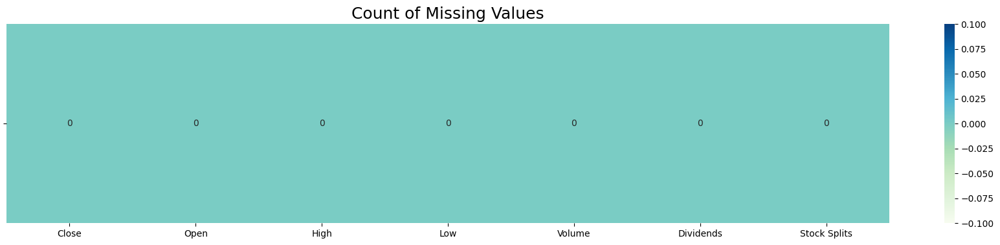
*Hình 1: Biểu đồ kiểm tra các cột có giá trị khuyết thiếu*

---

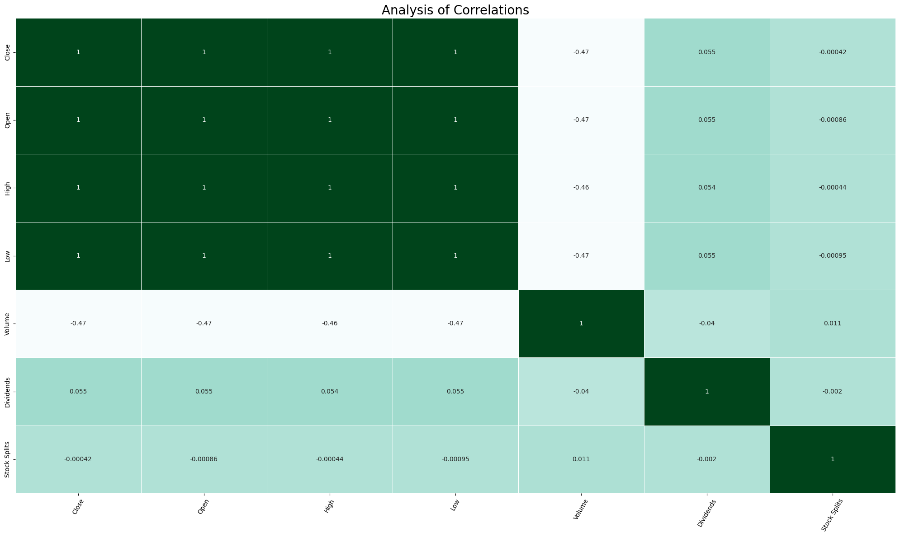
*Hình 2: Biểu đồ đánh giá sự tương quan giữa các thuộc tính*

- Tính tương quan giữa các biến giá cổ phiếu (Close, Open, High, Low):
    * Các mối quan hệ tương quan giữa 4 giá trị cổ phiếu này có giá trị bằng 1. Thể hiện một mối tương quan hoàn hảo và tích cực giữa chúng.
    * Các giá cổ phiếu có xu hướng hoạt động cùng chiều một cách chặt chẽ. Điều này được xác định một cách chính xác vì các mức giá này đều được mở bán trong cùng một thời gian giao dịch.
- Tính tương quan giữa các biến (Close, Open, High, Low) với các biến (Volume, Dividends, Stock Splits):
    * Với Volume: Các giá trị tương quan đều là -0.47~-0.46. Đây là tính tương quan tiêu cực và yếu. Điều này cho thấy có mối liên hệ yếu, khi giá tăng, khối lượng giao dịch có xu hướng giảm một chút, và ngược lại (Mối quan hệ này không mạnh).
    * Với Dividends: Các gia trị tương quan đều nằm ở mức 0.054. Đây là mức tương quan tích cực và rắt yếu. Mối quan hệ này không có mức ảnh hưởng nhiều đến giá cổ phiếu, cho thấy việc chi trả cổ tức không có mối liên hệ chặt chẽ với sự biến động của giá cổ phiếu.
    * Với Stock Splits: Các giá trị tương quan đều nằm trong mức 0.041~0.042. Đây là mối quan hệ tương quan tiêu cực và cực kỳ yếu. Việc chia tách cổ phiếu gần như không có mối quan hệ tương quan tuyến tính với sự biến động giá.
- Sự tương quan giữa các biến còn lại (Volume, Dividends, Stock Splits):
    * Các giá trị Volume, Dividends, Stock Splits không có mối tương quan liên hệ với nhau nên các giá trị tương quan tiêu cực và cực kỳ yếu.
    * Các ô trên đường chéo chính có giá trị tương quan mạnh mẽ vì một biến luôn tương quan mạnh mẽ với chính nó.

---

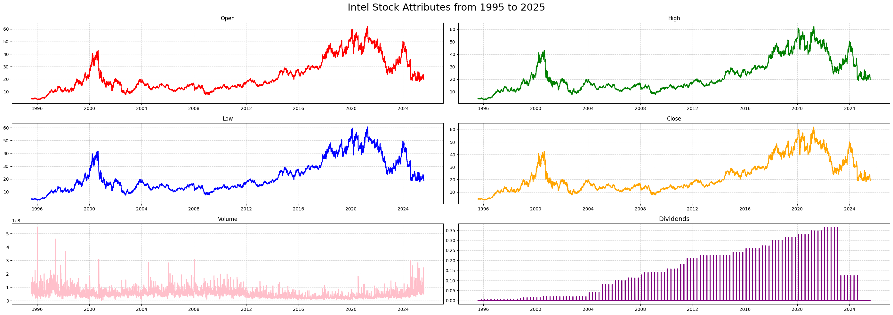
*Hình 3: Bảng các thuộc tính của cổ phiếu từ năm 1995 đến 2025*

---

*Hình 4: Bảng xu hướng thành phần theo tuần của mã cổ phiếu(INTC)*

---
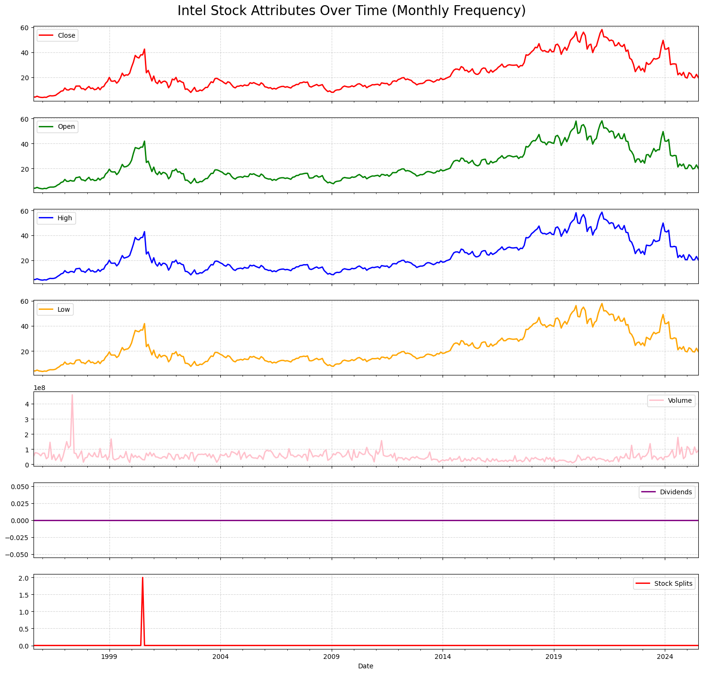
*Hình 4: Bảng xu hướng thành phần theo tháng của mã cổ phiếu(INTC)*

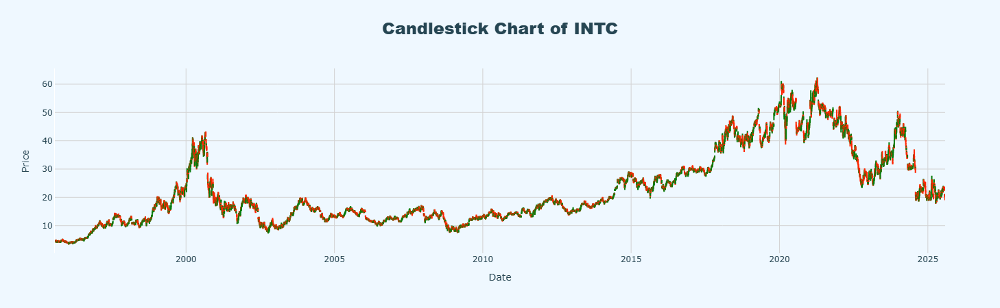
*Hình 5: Biểu đồ nến mã cổ phiếu từ năm 1995 đến 2025*

---
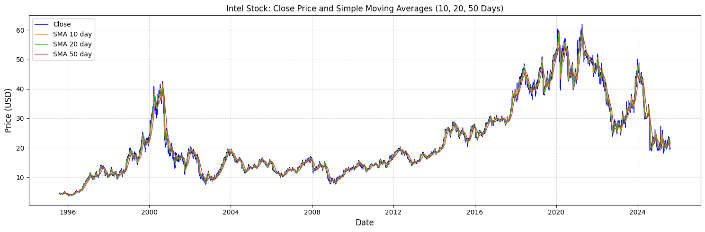
*Hình 6: Biểu đồ Simple Moving Averages (SMA)*

Trong chứng khoán, đường SMA (Simple Moving Average) là một chỉ báo kỹ thuật quan trọng, được tính bằng trung bình cộng giá đóng cửa của một số phiên giao dịch nhất định. Trên biểu đồ cổ phiếu INTC này, chúng ta sử dụng ba đường SMA phổ biến: 10 ngày (ngắn hạn), 20 ngày (trung hạn) và 50 ngày (dài hạn).

Quan sát biểu đồ, có thể thấy các đường SMA, đặc biệt là đường SMA 10 và SMA 20, di chuyển rất sát theo đường giá đóng cửa (màu xanh lam). Điều này là hợp lý vì chúng là giá trị trung bình của giá, giúp làm mượt các biến động hàng ngày và cho thấy xu hướng chính của cổ phiếu. Đường SMA chu kỳ càng ngắn (10 ngày) thì càng bám sát giá, trong khi đường SMA chu kỳ càng dài (50 ngày) thì di chuyển mượt hơn và có độ trễ lớn hơn so với giá.

# Mô Hình LSTM trong thư viện tensorflow

## Xác Định Xu Hướng (Trend Identification)

### Xu Hướng Tăng (Uptrend)
Khi **đường giá** nằm trên các **đường SMA** và các đường SMA dốc lên, đó là tín hiệu của một xu hướng tăng giá mạnh.

**Ví dụ trên biểu đồ:**  
Giai đoạn từ **năm 2016 đến 2020**, giá cổ phiếu **INTC** liên tục nằm trên các đường **SMA 10, SMA 20** và **SMA 50**, cho thấy một chu kỳ tăng trưởng bền vững.

---

### Xu Hướng Giảm (Downtrend)
Ngược lại, khi **đường giá** nằm dưới các **đường SMA** và các đường này dốc xuống, cổ phiếu đang trong xu hướng giảm giá.

**Ví dụ trên biểu đồ:**  
Giai đoạn từ **cuối năm 2021** đến nay (**2024**), giá liên tục nằm dưới các đường **SMA**, và các đường này đều hướng xuống, xác nhận một xu hướng giảm giá rõ ràng.

---
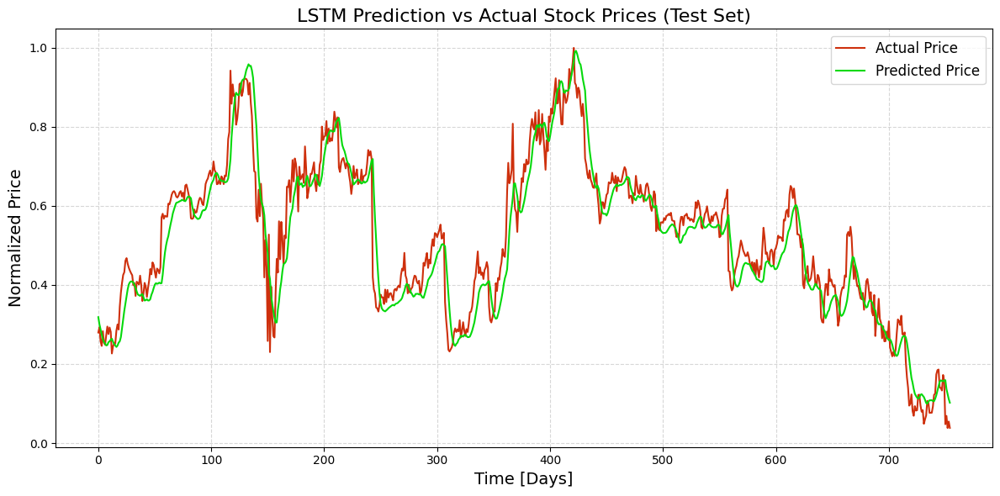
*Biểu đồ mô hình dự đoán giá trên tập kiểm tra của mô hình LSTM*

---
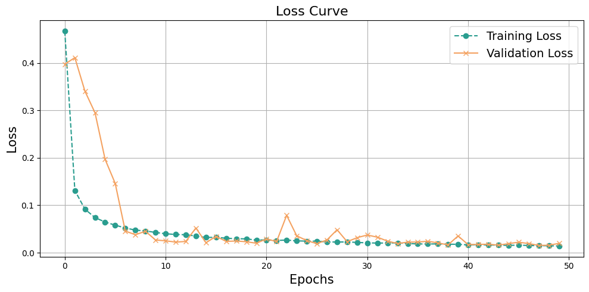

---
**Thống kê tham số của mô hình:**
Dưới đây là số lượng các lớp được sử dụng trong mô hình LSTM và số lượng tham số có trong mô hình.
# Model Summary

| Layer (type)             | Output Shape       | Param #  |
|--------------------------|--------------------|----------|
| Input (InputLayer)       | (None, 10, 5)      | 0        |
| BiLSTM_1 (Bidirectional) | (None, 10, 128)    | 35,840   |
| Dropout_1 (Dropout)      | (None, 10, 128)    | 0        |
| LSTM_2 (LSTM)            | (None, 32)         | 20,608   |
| BatchNorm (BatchNormalization) | (None, 32)  | 128      |
| Dropout_2 (Dropout)      | (None, 32)         | 0        |
| Dense_1 (Dense)          | (None, 64)         | 2,112    |
| Dense_2 (Dense)          | (None, 8)          | 520      |
| output (Dense)           | (None, 1)          | 9        |

---

**Total params:** 177,525 (693.46 KB)  
**Trainable params:** 59,153 (231.07 KB)  
**Non-trainable params:** 64 (256.00 B)  
**Optimizer params:** 118,308 (462.14 KB)

---
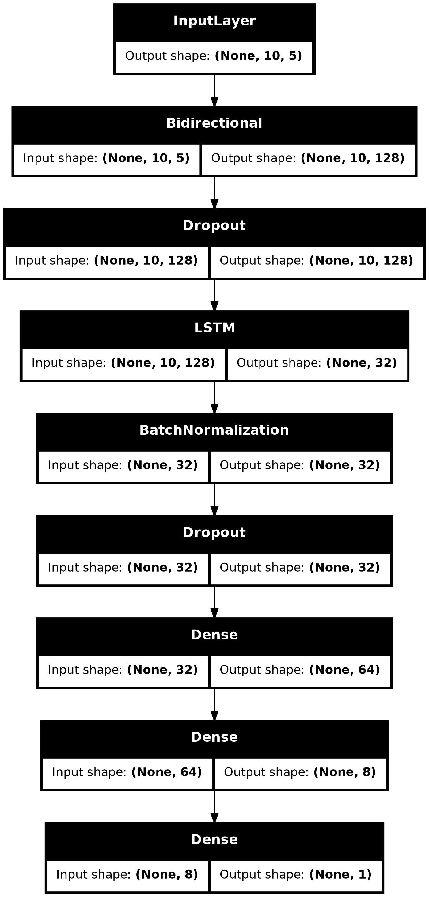
*Thứ tự các lớp trong mô hình huấn luyện dữ liệu*

---
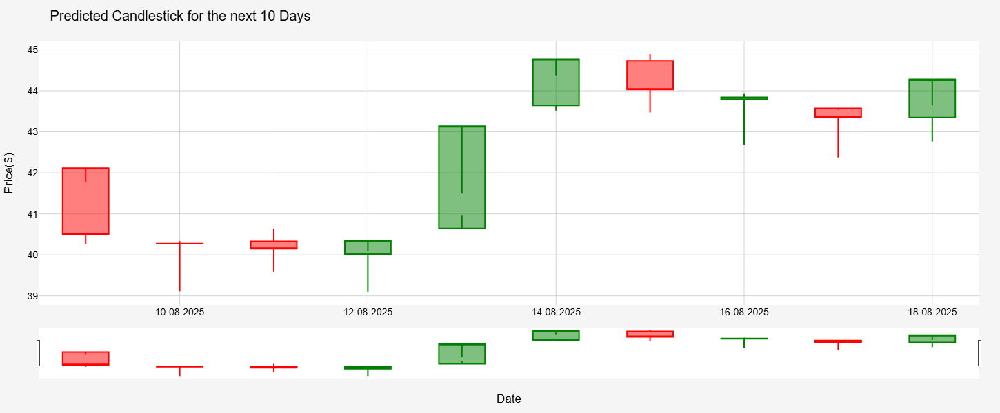

---
# Mô hình LSTM trong pytorch
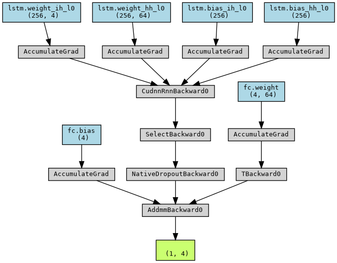
*Các lớp kiến trúc của mô hình LSTM trong pytorch*

---
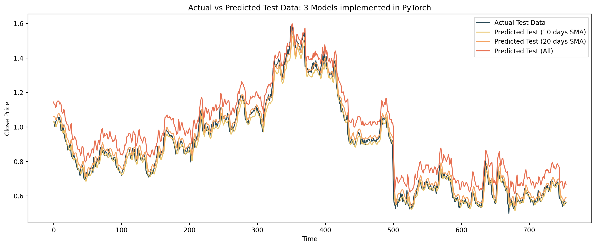
*Các đường trung bình động dự đoán trong mô hình LSTM*

---
| Date                          | Open       | High       | Low        | Close     |
|--------------------------------|------------|------------|------------|-----------|
| 2025-08-09 00:00:00-04:00      | 22.798178  | 22.926321  | 22.284174  | 22.780577 |
| 2025-08-10 00:00:00-04:00      | 25.981989  | 26.121090  | 25.394033  | 25.970390 |
| 2025-08-11 00:00:00-04:00      | 30.439528  | 30.594013  | 29.747911  | 30.436256 |
| 2025-08-12 00:00:00-04:00      | 35.534439  | 35.706524  | 34.724270  | 35.540638 |
| 2025-08-13 00:00:00-04:00      | 40.433231  | 40.622246  | 39.509010  | 40.448498 |
| 2025-08-14 00:00:00-04:00      | 44.415901  | 44.618675  | 43.398895  | 44.438503 |
| 2025-08-15 00:00:00-04:00      | 47.163704  | 47.375965  | 46.082630  | 47.191341 |
| 2025-08-16 00:00:00-04:00      | 48.775654  | 48.993477  | 47.656956  | 48.806217 |
| 2025-08-17 00:00:00-04:00      | 49.568550  | 49.789116  | 48.431324  | 49.600536 |
| 2025-08-18 00:00:00-04:00      | 49.872292  | 50.093903  | 48.727943  | 49.904816 |

*Dự đoán giá trong 10 ngày tới của mô hình LSTM*

---

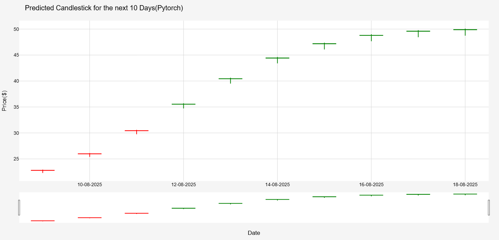