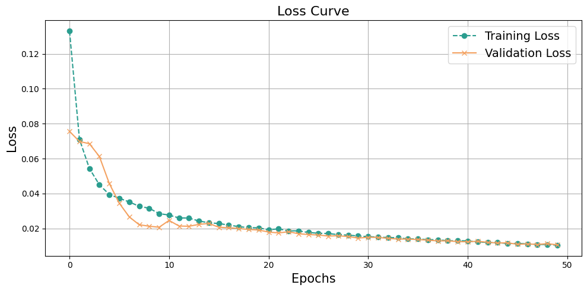

# Time Series Forecasting

Time series forecasting is a sequence of data points in chronological order that businesses use to analyze past data and make future predictions. These data points are a set of observations at specific, equally spaced time intervals, usually with a corresponding timestamp and value.

---

## Time series data consists of four components:

-   **Trend Component**: An increase or decrease in movement following a predictable pattern over a long period.
-   **Seasonal Component**: Regular and cyclical fluctuations that repeat over a specific period, such as a day, week, month, or season.
-   **Cyclical Component**: Fluctuations that correspond to the "boom-bust" cycles of a business or the economy, or that follow their own distinct cycles.
-   **Irregular/Noise Component**: Abnormal or residual fluctuations that do not fall into any of the three categories above.

---

## Objective:

To forecast the stock price for the **next 10 days**. To provide an assessment of Intel's (INTC) stock price trend in the context of a volatile market due to the global recession, the hardware technology race, and the influence of political factors such as the Middle East-US conflict.

The purpose of this report is to **propose a suitable investment strategy** for the Intel stock by analyzing quantitative and qualitative factors, thereby helping investors make accurate buy/sell decisions.

---

## Questions to be addressed:

-   When will the stock reach its **highest/lowest price**?
-   **When is the best time to buy or sell** the stock?
-   Why did the company sell a large volume of shares at a specific time?
-   How do **media and political factors** influence stock price fluctuations?

---

## Data Collection:

-   Data was collected from [Yahoo! Finance](https://finance.yahoo.com) using the **`yfinance`** library in Python.
-   Function used: `yf.Ticker("INTC").history()`

---

## Data Preprocessing & Exploratory Data Analysis (EDA)

Data was retrieved from `yfinance` using the `history()` function for the Intel (INTC) stock, from **August 1, 1995**, to **August 1, 2025**.

-   Data size: **7551 rows × 7 columns**
-   Each row corresponds to **one day's trading data**

### Data columns include:

-   `Open`: Daily opening price
-   `High`: Highest price of the day
-   `Low`: Lowest price of the day
-   `Close`: Closing price
-   `Volume`: Trading volume
-   `Dividends`: Dividends paid (if any)
-   `Stock Splits`: Information on stock splits (if any)

---

### Data Example

| Date | Open | High | Low | Close | Volume | Dividends | Stock Splits |
| :--- | :--- | :--- | :--- | :--- | :--- | :--- | :--- |
| 1995-08-01 00:00:00 | 4.579953 | 4.579953 | 4.403801 | 4.456646 | 94556800 | 0.0 | 0.0 |
| 1995-08-02 00:00:00 | 4.535913 | 4.579951 | 4.298107 | 4.333338 | 135620800 | 0.0 | 0.0 |
| 1995-08-03 00:00:00 | 4.210034 | 4.421416 | 4.165996 | 4.377378 | 117961600 | 0.0 | 0.0 |
| ... | ... | ... | ... | ... | ... | ... | ... |
| 2025-07-31 00:00:00 | 20.170000 | 20.230000 | 19.660000 | 19.799999 | 90665200 | 0.0 | 0.0 |
| 2025-08-01 00:00:00 | 19.500000 | 19.549999 | 18.969999 | 19.309999 | 86320300 | 0.0 | 0.0 |

---

### INTC Stock Statistics

| | count | mean | std | min | 25% | 50% | 75% | max |
| :--- | :--- | :--- | :--- | :--- | :--- | :--- | :--- | :--- |
| **Close** | 7551.000000 | 22.418300 | 12.848665 | 3.525117 | 13.046332 | 17.585255 | 29.358292 | 62.083336 |
| **Open** | 7551.000000 | 22.419083 | 12.845417 | 3.577995 | 13.068528 | 17.583751 | 29.372653 | 62.028760 |
| **High** | 7551.000000 | 22.720441 | 12.998605 | 3.639684 | 13.217902 | 17.801679 | 29.638943 | 62.292520 |
| **Low** | 7551.000000 | 22.119990 | 12.696241 | 3.511898 | 12.916718 | 17.365325 | 29.101334 | 60.600826 |
| **Volume** | 7551.000000 | 51977040.68 | 30777120.66 | 1155400.00 | 30426050.00 | 47224400.00 | 65218550.00 | 546630400.0 |
| **Dividends** | 7551.000000 | 0.002358 | 0.023918 | 0.000000 | 0.000000 | 0.000000 | 0.000000 | 0.365000 |
| **Stock Splits** | 7551.000000 | 0.000795 | 0.039859 | 0.000000 | 0.000000 | 0.000000 | 0.000000 | 2.000000 |

---

## Data Visualization

*Figure 1: Chart checking for missing values in columns*

---

*Figure 2: Chart evaluating the correlation between attributes*

-   **Correlation between stock price variables (Close, Open, High, Low):**
    -   The correlation values between these four stock prices are all 1, indicating a perfect positive correlation.
    -   The stock prices tend to move in the same direction, which is expected as these prices are all from the same trading period.
-   **Correlation between price variables (Close, Open, High, Low) and other variables (Volume, Dividends, Stock Splits):**
    -   **With Volume:** The correlation values are all around -0.47 to -0.46, indicating a weak negative correlation. This suggests a weak relationship where as the price increases, the trading volume tends to decrease slightly, and vice versa.
    -   **With Dividends:** The correlation values are around 0.054, indicating a very weak positive correlation. This relationship has little impact on the stock price, suggesting that dividend payments are not strongly related to stock price fluctuations.
    -   **With Stock Splits:** The correlation values are between 0.041 and 0.042, indicating an extremely weak negative correlation. Stock splits have almost no linear correlation with price fluctuations.
-   **Correlation between the remaining variables (Volume, Dividends, Stock Splits):**
    -   Volume, Dividends, and Stock Splits have no significant correlation with each other, resulting in very weak and negative correlation values.
    -   The cells on the main diagonal have a strong correlation value because a variable is always perfectly correlated with itself.

---

*Figure 3: Table of stock attributes from 1995 to 2025*

---

*Figure 4: Table of weekly component trends for INTC stock*

---

*Figure 4: Table of monthly component trends for INTC stock*

---

*Figure 5: Candlestick chart of INTC stock from 1995 to 2025*

---

*Figure 6: Simple Moving Averages (SMA) Chart*

In stock trading, the Simple Moving Average (SMA) is a crucial technical indicator, calculated as the average closing price over a specific number of trading sessions. On this INTC stock chart, we use three common SMAs: 10-day (short-term), 20-day (medium-term), and 50-day (long-term).

Observing the chart, we can see that the SMAs, especially the 10-day and 20-day SMAs, move very closely to the closing price line (in blue). This is logical as they are the average prices, helping to smooth out daily fluctuations and reveal the main trend of the stock. The shorter the SMA period (10 days), the closer it follows the price, while the longer the SMA period (50 days), the smoother it moves and the greater its lag relative to the price.

# LSTM Model in TensorFlow

## Trend Identification

### Uptrend
When the **price line** is above the **SMA lines** and the SMA lines are sloping upwards, it is a signal of a strong uptrend.

**Example on the chart:**
From **2016 to 2020**, the **INTC** stock price was consistently above the **SMA 10, SMA 20**, and **SMA 50**, indicating a sustainable growth cycle.

---

### Downtrend
Conversely, when the **price line** is below the **SMA lines** and these lines are sloping downwards, the stock is in a downtrend.

**Example on the chart:**
From **late 2021** to the present (**2024**), the price has consistently been below the **SMAs**, and these lines are all pointing downwards, confirming a clear downtrend.

---

*Chart of the model's price predictions on the LSTM model's test set*

---

---

**Model Parameter Statistics:**
Below is the number of layers used in the LSTM model and the number of parameters in the model.

# Model Summary

| Layer (type) | Output Shape | Param # |
| :--- | :--- | :--- |
| Input (InputLayer) | (None, 10, 5) | 0 |
| BiLSTM\_1 (Bidirectional) | (None, 10, 128) | 35,840 |
| Dropout\_1 (Dropout) | (None, 10, 128) | 0 |
| LSTM\_2 (LSTM) | (None, 32) | 20,608 |
| BatchNorm (BatchNormalization) | (None, 32) | 128 |
| Dropout\_2 (Dropout) | (None, 32) | 0 |
| Dense\_1 (Dense) | (None, 64) | 2,112 |
| Dense\_2 (Dense) | (None, 8) | 520 |
| output (Dense) | (None, 1) | 9 |

---

**Total params:** 177,525 (693.46 KB)
**Trainable params:** 59,153 (231.07 KB)
**Non-trainable params:** 64 (256.00 B)
**Optimizer params:** 118,308 (462.14 KB)

---

*Order of layers in the data training model*

---

---

# LSTM Model in PyTorch

*Architectural layers of the LSTM model in PyTorch*

---

*Predicted Simple Moving Averages in the LSTM model*

---

| Date | Open | High | Low | Close |
| :--- | :--- | :--- | :--- | :--- |
| 2025-08-09 00:00:00-04:00 | 22.798178 | 22.926321 | 22.284174 | 22.780577 |
| 2025-08-10 00:00:00-04:00 | 25.981989 | 26.121090 | 25.394033 | 25.970390 |
| 2025-08-11 00:00:00-04:00 | 30.439528 | 30.594013 | 29.747911 | 30.436256 |
| 2025-08-12 00:00:00-04:00 | 35.534439 | 35.706524 | 34.724270 | 35.540638 |
| 2025-08-13 00:00:00-04:00 | 40.433231 | 40.622246 | 39.509010 | 40.448498 |
| 2025-08-14 00:00:00-04:00 | 44.415901 | 44.618675 | 43.398895 | 44.438503 |
| 2025-08-15 00:00:00-04:00 | 47.163704 | 47.375965 | 46.082630 | 47.191341 |
| 2025-08-16 00:00:00-04:00 | 48.775654 | 48.993477 | 47.656956 | 48.806217 |
| 2025-08-17 00:00:00-04:00 | 49.568550 | 49.789116 | 48.431324 | 49.600536 |
| 2025-08-18 00:00:00-04:00 | 49.872292 | 50.093903 | 48.727943 | 49.904816 |

*Predicted prices for the next 10 days by the LSTM model*

---

